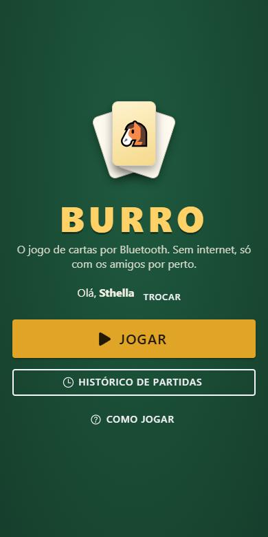
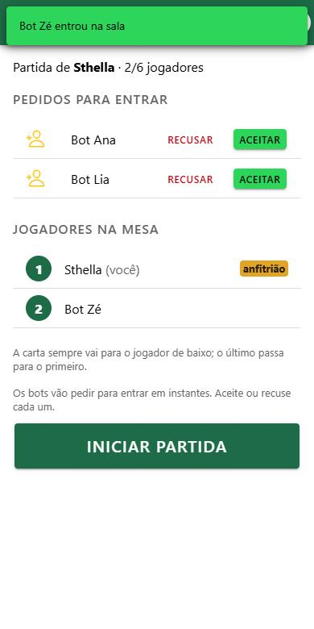
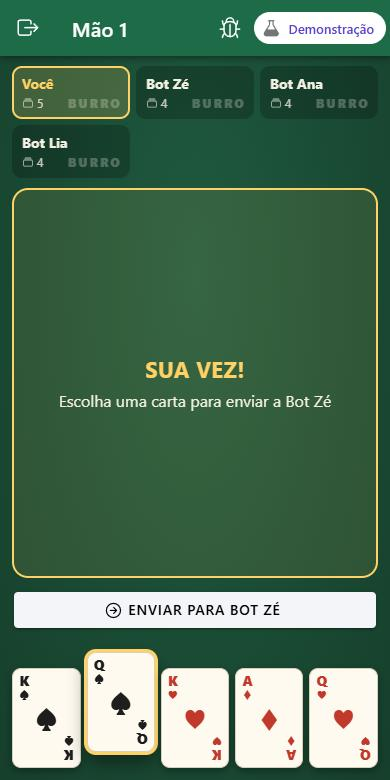
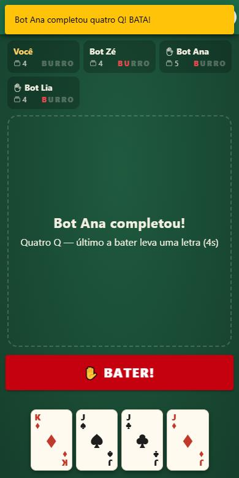
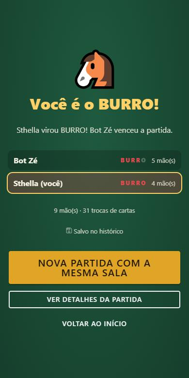
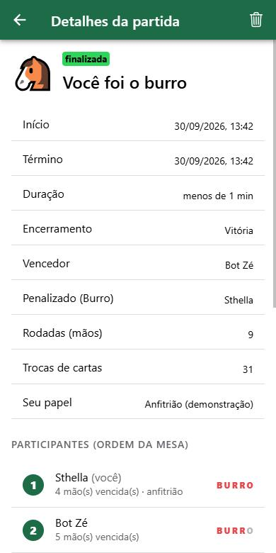

# 🐴 Burro — jogo de cartas via Bluetooth

Jogo de cartas **Burro** multiplayer (2 a 6 jogadores) para celulares Android, feito com
**Vue 3 + Ionic + Capacitor**. Os aparelhos se conectam por **Bluetooth Low Energy**,
sem internet: um jogador cria a partida (anfitrião) e os outros entram.

<p>
  
  
  
  
</p>

---

## 📚 Curso e unidades curriculares

**Curso:** _<preencher: nome do curso técnico>_

| Unidade curricular | Indicadores | Onde está no projeto |
|---|---|---|
| **Codificar acesso à web services e recursos de sistemas móveis** | Integra recursos nativos do dispositivo, de acordo com as necessidades do aplicativo e as características do sistema mobile. | Bluetooth LE (`@capacitor-community/bluetooth-le` + plugin nativo Java `BurroPeripheral`), permissões Android, vibração (`@capacitor/haptics`), sistema de arquivos. |
| | Aplica correções e melhorias a partir da validação e depuração do código de integração, conforme necessidades do projeto. | Validação de todas as mensagens recebidas (`src/protocol/validation.ts`), fragmentação/remontagem BLE, tratamento de desconexão e reconexão, testes automatizados. |
| **Codificar aplicações para dispositivos móveis** | Aplica recursos da biblioteca do sistema mobile de acordo com necessidades do aplicativo. | Componentes Ionic (listas deslizantes, alertas de confirmação, toasts, modais, segment), navegação `@ionic/vue-router`. |
| | Programa persistência local de dados utilizando arquivos e banco de dados portáveis. | Histórico em **SQLite** (`@capacitor-community/sqlite`), perfil em **arquivo JSON** e exportação do histórico em arquivo (`@capacitor/filesystem`). |

## 👥 Integrantes

| Nome | GitHub |
|---|---|
| _<sthella>_ | [@usuario1](https://github.com/sthellasxz) |
| _<luiza 2>_ | [@usuario2](https://github.com/luizalimaam) |
| _<maria luiza  3>_ | [@usuario3](https://github.com/maluffreitass77) |

---

## 🎮 Como o jogo funciona

**Objetivo:** juntar **4 cartas do mesmo valor** antes de todo mundo e não ficar com as letras de **B‑U‑R‑R‑O**.

1. O baralho tem **um valor por jogador** (4 naipes cada) **+ 1 carta 🐴 Burro**, que nunca forma grupo.
2. Cada um recebe **4 cartas**; quem começa recebe **5**.
3. Na sua vez (você tem 5 cartas), **escolha uma carta** e toque em **Enviar para <próximo>**. Ela vai para o próximo da mesa, que passa a ser o da vez.
4. Formou 4 iguais? Toque em **🐴 COMPLETEI!**
5. Os outros têm **6 segundos** para tocar em **✋ BATER!** — **o último a bater leva uma letra**.
6. Quem juntar **BURRO** (5 letras) perde. Vence quem tiver menos letras.

Regras completas e casos especiais: [docs/REGRAS.md](docs/REGRAS.md).

## 📱 Como jogar

1. Instale o app em **2 ou mais celulares Android** (veja [Instalação](#-instalação-e-execução)).
2. Ligue o **Bluetooth** em todos (internet não é necessária).
3. Abra o app, toque em **Jogar** e informe seu nome.
4. **Um** jogador toca em **Criar partida** (será o anfitrião).
5. Os outros tocam em **Procurar partida** e escolhem a partida do anfitrião.
6. O anfitrião **aceita** (ou recusa) cada pedido e toca em **Iniciar partida**.
7. Jogue! O histórico fica em **Histórico de partidas** na tela inicial.

> Sem dois celulares? Use o **Modo demonstração** (contra 1 a 5 bots), que também funciona no navegador.

## 🧱 Telas

| Tela | Rota | Arquivo |
|---|---|---|
| Inicial | `/` | `src/views/HomePage.vue` |
| Identificação do jogador | `/identificacao` | `IdentificacaoPage.vue` |
| Criar ou procurar partida | `/partida` | `PartidaPage.vue` |
| Conexão Bluetooth | `/bluetooth` | `BluetoothPage.vue` |
| Sala de espera | `/sala` | `SalaPage.vue` |
| Jogo | `/jogo` | `JogoPage.vue` |
| Resultado | `/resultado` | `ResultadoPage.vue` |
| Histórico | `/historico` | `HistoricoPage.vue` |
| Detalhes da partida | `/historico/:id` | `DetalhePartidaPage.vue` |

<p>
  
  
  
</p>

---

## 🛠 Instalação e execução

### Pré-requisitos

- [Node.js](https://nodejs.org) 20 ou superior
- Para o celular: [Android Studio](https://developer.android.com/studio) (inclui o JDK 21 e o Android SDK)
- Celulares com **Android 7+** e Bluetooth LE. Para **criar** partida, o aparelho precisa suportar modo periférico BLE (a maioria dos celulares desde 2017).

### 1. Rodar no navegador (modo demonstração)

```bash
npm install
npm run dev
```

Abra http://localhost:5173 e escolha **Modo demonstração**. O Bluetooth não funciona no navegador.

### 2. Rodar no celular Android

```bash
npm install
npm run build
npx cap sync android
npx cap open android
```

No Android Studio: conecte o celular com **Depuração USB** ativada e clique em ▶ **Run**.
Para gerar um APK: **Build › Build App Bundle(s) / APK(s) › Build APK(s)** — o arquivo fica em
`android/app/build/outputs/apk/debug/app-debug.apk` e pode ser copiado para os outros celulares.

Sempre que mudar o código web: `npm run build && npx cap sync android`.

### 3. Testes

```bash
npm test
```

Lista dos testes obrigatórios e roteiro de teste manual com dois celulares: [docs/TESTES.md](docs/TESTES.md).

## 🔐 Permissões

### Android

| Permissão | Versão | Para quê |
|---|---|---|
| `BLUETOOTH_SCAN` (`neverForLocation`) | 12+ | Convidado procurar partidas |
| `BLUETOOTH_CONNECT` | 12+ | Conectar e trocar mensagens |
| `BLUETOOTH_ADVERTISE` | 12+ | Anfitrião anunciar a partida |
| `BLUETOOTH`, `BLUETOOTH_ADMIN` | até 11 | Bluetooth nas versões antigas |
| `ACCESS_FINE_LOCATION` / `ACCESS_COARSE_LOCATION` | até 11 | Exigência do Android antigo para procurar dispositivos BLE |
| `INTERNET` | todas | Padrão do Capacitor (WebView). O jogo **não** usa internet. |

No Android 12+ o sistema mostra a permissão como **"Dispositivos próximos"**. Se for negada,
o app avisa e oferece o botão **Abrir configurações do app**. Se o Bluetooth estiver desligado,
o app pede para ligá-lo.

### iOS

Não suportado nesta versão (ver limitações). Para portar seria preciso `NSBluetoothAlwaysUsageDescription`
no `Info.plist` e uma implementação iOS (CoreBluetooth `CBPeripheralManager`) do plugin do anfitrião.

## 🗂 Estrutura do projeto

```
src/
  game/         regras do jogo (TypeScript puro): tipos, baralho, motor, visão por jogador, bot
  protocol/     formato e validação das mensagens Bluetooth
  transport/    ble/ (cliente bluetooth-le + anfitrião nativo), demo/ (bots), framing.ts
  session/      HostController e ClientController
  storage/      histórico (SQLite / localStorage), perfil e exportação em arquivo
  stores/       Pinia (perfil, sessão)
  views/        telas
  components/   carta, letras BURRO, status da conexão
android/app/src/main/java/com/jogoburro/app/
  BurroPeripheralPlugin.java   plugin nativo do anfitrião (GATT server + advertising)
tests/          testes Vitest
docs/           regras, protocolo, decisões técnicas, testes e prints
```

Documentação técnica:
- [Protocolo e diagrama da comunicação](docs/PROTOCOLO.md)
- [Decisões técnicas](docs/DECISOES.md)
- [Regras implementadas](docs/REGRAS.md)

## 🤝 Como contribuir

1. Faça um **fork** (ou, se for da equipe, clone o repositório).
2. Crie uma branch a partir da `main`: `git checkout -b feat/minha-melhoria`.
3. Rode `npm install` e `npm run dev`; teste no modo demonstração e, se mexer em Bluetooth, em dois celulares.
4. Antes de enviar: `npm run typecheck` e `npm test` precisam passar.
5. Faça commits pequenos e descritivos (ex.: `fix: bloqueia bater duas vezes`).
6. Abra um **Pull Request** para a `main` explicando o que mudou e como testar. Pelo menos outro integrante revisa antes do merge.

Boas práticas do projeto:
- Regras do jogo ficam em `src/game` (sem Vue); toda regra nova ganha teste em `tests/`.
- Toda mensagem nova precisa entrar em `src/protocol/messages.ts`, na validação e em `docs/PROTOCOLO.md`.

## ⚠️ Limitações

- **Apenas Android.** O anfitrião usa um plugin nativo Java; não há versão iOS nem web do Bluetooth.
- Alguns aparelhos (principalmente antigos/baratos) **não suportam modo periférico BLE** e não conseguem **criar** partida — mas conseguem **entrar**.
- **Se o anfitrião sair ou perder a conexão, a partida acaba** (o estado fica só no aparelho dele). Os convidados tentam reconectar por 45 s.
- Jogador que sai no meio da partida encerra a partida para todos (não há "remover da roda e continuar").
- A disputa do **BATER** depende da latência do Bluetooth: o anfitrião tem uma pequena vantagem (toca sem passar pelo rádio).
- Alcance típico do BLE: ~10 m, melhor com os celulares na mesma mesa.
- O histórico é **local de cada aparelho**; não há sincronização entre celulares.
- A comunicação BLE não é criptografada pelo app; qualquer app de "sniffer" BLE poderia ler as mensagens.

## ✅ Checklist de funcionalidades

**Jogador e partida**
- [x] Informar nome antes de criar/entrar (salvo em arquivo local)
- [x] Identificador único do jogador
- [x] Criar partida (criador = anfitrião)
- [x] Procurar partidas via Bluetooth
- [x] Solicitar entrada / anfitrião aceita ou recusa
- [x] Sair da sala antes do início (com confirmação)
- [x] Início só com 2+ jogadores (até 6)
- [x] Nova partida após o encerramento, com a mesma sala

**Bluetooth**
- [x] Pedir permissões e tratar permissão negada
- [x] Tratar Bluetooth desligado (pede para ligar)
- [x] Informar conexão estabelecida e estado da conexão
- [x] Informar desconexão de jogador
- [x] Formato de mensagem definido e documentado
- [x] Validar mensagens antes de alterar o estado
- [x] Bloquear jogadas fora do turno (no convidado e no anfitrião)
- [x] Reconexão (até 45 s)
- [x] Funciona sem internet

**Jogo**
- [x] Embaralhar e distribuir automaticamente
- [x] Cada jogador vê só as próprias cartas
- [x] Indicar jogador da vez, de quem recebe e para quem envia
- [x] Selecionar e confirmar carta
- [x] Validar jogada
- [x] Atualizar e sincronizar as mãos após cada troca
- [x] Detectar 4 cartas iguais
- [x] Penalidade com letras de BURRO
- [x] Identificar vencedor e penalizado
- [x] Tela de resultado

**Histórico**
- [x] Salvar automaticamente (finalizadas, canceladas e interrompidas)
- [x] Lista com data/hora, nº de jogadores, participantes, vencedor, penalizado e resultado local
- [x] Detalhes: início, término, participantes, ordem, vencedor, penalizado, rodadas, resultado, motivo
- [x] Excluir uma partida (com confirmação)
- [x] Limpar tudo (com confirmação)
- [x] Persistência em SQLite após fechar o app
- [x] Exportar histórico para arquivo JSON (extra)

**Extras**
- [x] Modo demonstração com bots (mesmo protocolo do Bluetooth)
- [x] Simulação de queda de conexão para testes
- [x] Vibração em eventos importantes
- [ ] Suporte a iOS
- [ ] Vídeo da partida completa — _<link do vídeo>_

## 📄 Licença

Projeto acadêmico, uso educacional.
