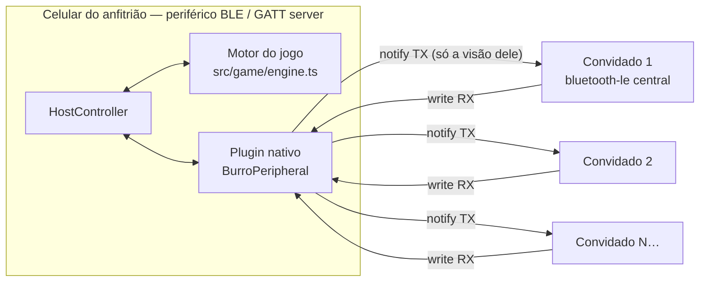
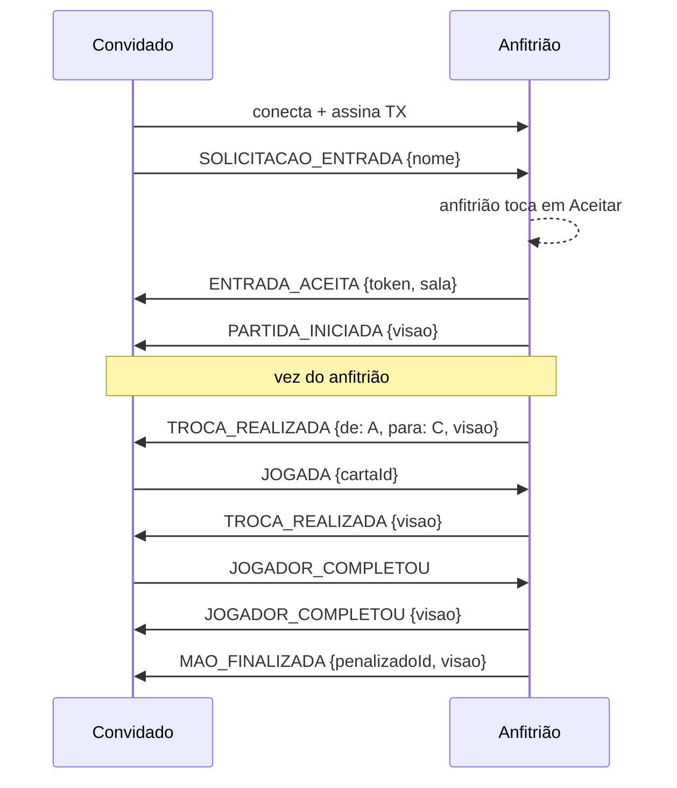

# Comunicação Bluetooth e protocolo de mensagens

## Topologia

Estrela: o **anfitrião** é o centro e o único que conhece o estado completo da partida.
Os convidados só falam com o anfitrião, nunca entre si.



| Papel | Plugin | Papel BLE |
|---|---|---|
| Convidado | `@capacitor-community/bluetooth-le` | Central: procura, conecta, escreve em RX, assina TX |
| Anfitrião | `BurroPeripheral` (plugin Java próprio, em `android/app/src/main/java/com/jogoburro/app/`) | Periférico: anuncia a sala e mantém o GATT server |

> O `bluetooth-le` só implementa o papel de central. Para criar uma partida o celular precisa
> **anunciar** e **aceitar conexões**, por isso escrevemos o plugin `BurroPeripheral`.

### Serviço GATT

| Item | UUID | Propriedades |
|---|---|---|
| Serviço do jogo | `6b1d0001-5c3a-4f7e-9b2e-8a4c0f1e2d3b` | primário |
| RX (convidado → anfitrião) | `6b1d0002-5c3a-4f7e-9b2e-8a4c0f1e2d3b` | write, write without response |
| TX (anfitrião → convidado) | `6b1d0003-5c3a-4f7e-9b2e-8a4c0f1e2d3b` | notify (+ descritor CCCD 0x2902) |

### Anúncio (advertising)

- Pacote principal: UUID do serviço (os convidados filtram a busca por ele).
- Scan response: dados de fabricante, company id `0xFFFF` (reservado para testes):
  `[versão=1, jogadores, máximo, emAndamento(0/1), …nome do anfitrião em UTF‑8 (até 23 bytes)]`.
- O anúncio é atualizado quando alguém entra/sai ou a partida começa.

### Fragmentação

Uma escrita/notificação BLE leva no máximo `MTU − 3` bytes (20 bytes sem negociação;
até 509 com MTU 512, que o `bluetooth-le` negocia no Android). Cada mensagem JSON é
dividida em quadros com cabeçalho de 3 bytes (`src/transport/framing.ts`):

```
[nº da mensagem 0–255] [índice do quadro] [total de quadros] [pedaço UTF‑8…]
```

Um quadro perdido ou fora de ordem descarta a mensagem inteira (nunca aplicamos JSON parcial).
Os envios passam por uma fila serial: o Android não aceita duas operações GATT ao mesmo tempo.

## Formato das mensagens

Toda mensagem é um JSON com o mesmo envelope:

```json
{
  "v": 1,
  "tipo": "JOGADA",
  "id": "lx3k9a1f2c",
  "remetente": "0b6c1f2e-…",
  "ts": 1790786402292,
  "dados": { "cartaId": "K-copas" }
}
```

| Campo | Descrição |
|---|---|
| `v` | Versão do protocolo. Mensagem de outra versão é descartada. |
| `tipo` | Um dos tipos abaixo. |
| `id` | Identificador único da mensagem. |
| `remetente` | Id do jogador que enviou. O anfitrião confere se bate com o dispositivo conectado. |
| `ts` | Data/hora do envio (ms). |
| `dados` | Conteúdo específico do tipo. |

### Convidado → anfitrião

| Tipo | Dados | Quando |
|---|---|---|
| `SOLICITACAO_ENTRADA` | `{ nome, jogadorId }` | Logo após conectar |
| `RECONEXAO` | `{ jogadorId, token }` | Após reconectar no meio da partida |
| `JOGADA` | `{ cartaId }` | Enviar carta ao próximo jogador |
| `JOGADOR_COMPLETOU` | `{}` | Tem 4 cartas iguais |
| `BATER` | `{}` | Bater depois que alguém completou |
| `JOGADOR_SAIU` | `{}` | Saiu da sala ou abandonou |

### Anfitrião → convidado

Mensagens de jogo levam `visao`: o estado público da partida **mais somente as cartas do destinatário**
(`VisaoJogador` em `src/game/types.ts`). Cada convidado recebe uma notificação própria.

| Tipo | Dados |
|---|---|
| `ENTRADA_ACEITA` | `{ jogadorId, token, sala }` |
| `ENTRADA_RECUSADA` | `{ motivo }` |
| `JOGADOR_ENTROU` | `{ jogador, sala }` |
| `JOGADOR_SAIU` | `{ jogadorId, nome, sala }` |
| `SALA_ATUALIZADA` | `{ sala }` — nova partida com a mesma sala |
| `PARTIDA_INICIADA` | `{ visao }` |
| `TROCA_REALIZADA` | `{ de, para, visao }` |
| `JOGADOR_COMPLETOU` | `{ jogadorId, valor, visao }` |
| `BATER` | `{ jogadorId, visao }` |
| `MAO_FINALIZADA` | `{ vencedorId, penalizadoId, visao }` |
| `NOVA_MAO` | `{ numero, visao }` |
| `JOGADOR_DESCONECTADO` | `{ jogadorId, visao }` |
| `RECONEXAO` | `{ jogadorId, visao }` |
| `ESTADO` | `{ visao }` — reenvio completo do estado |
| `PARTIDA_FINALIZADA` | `{ resultado, visao }` (`visao: null` = sala fechada antes de começar) |
| `ERRO` | `{ codigo, mensagem }` — ex.: `JOGADA_INVALIDA`, `NAO_AUTORIZADO` |

## Validação (antes de alterar qualquer estado)

1. **Estrutura** (`src/protocol/validation.ts`): JSON válido, versão, tipo conhecido, campos obrigatórios e tamanhos.
2. **Autorização** (`HostController`): o dispositivo precisa ter sido aceito e `remetente` precisa ser o jogador daquele dispositivo — ninguém joga em nome de outro.
3. **Regra do jogo** (`aplicarAcao` em `src/game/engine.ts`): fase correta, é a vez do jogador, a carta está na mão, o grupo de 4 existe, partida não está pausada.
4. O convidado também **pré‑valida** a própria jogada antes de enviar e descarta mensagens cuja `visao` seja de outro jogador.

O motor é **puro**: cada ação gera um estado novo ou um erro, nunca um estado “pela metade”.

## Sequência típica



## Desconexão e reconexão

- Anfitrião detecta a queda → marca o jogador como desconectado, **pausa** a partida e avisa os demais (`JOGADOR_DESCONECTADO`).
- O convidado tenta reconectar ao mesmo anfitrião a cada 3 s por até **45 s** e envia `RECONEXAO {jogadorId, token}`.
  O `token` foi entregue no `ENTRADA_ACEITA` e impede que outro aparelho assuma o lugar.
- Reconectou → a partida volta (`RECONEXAO` com a visão atual). Não voltou em 45 s → partida `interrompida` por `desconexao`, e todos gravam no histórico.
- Se o **anfitrião** some, não há como continuar (ele guarda o estado): os convidados tentam reconectar por 45 s e depois registram a partida como interrompida.
